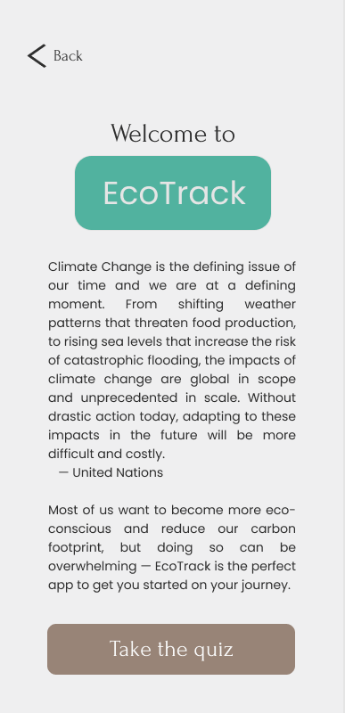

# 🍃🌻 EcoTrack

This project was submitted to [SheHacks VI](https://shehacks-vi.devpost.com/), one of Canada's largest all-female and non-binary student hackathons hosted by [WITS+](https://wits-uwo.ca/). 

*See [The Team](#-the-team) for more details.*

### 🌱 What inspired EcoTrack

One of the most critical problems the world faces today is, without a doubt, climate change. Despite the devastating impacts of the COVID-19 pandemic, it brought about some positive change for our planet — the gradual recovery of natural habitats for fauna and flora worldwide. We recognize that we must be proactive in our mission to protect the environment, and that action must be taken on a mass scale to effectively tackle the issue.

Want to become more eco-conscious and reduce your carbon footprint, but not sure how? EcoTrack is the perfect app for you — our team designed the app for the everyday person so that it's easy to adopt, track, and work towards environmentally-friendly habits.

### 🌿 Develop more eco-conscious habits based on your ecological personality type

EcoTrack is a mobile app aiming to incentivize environmentally-friendly behaviour — it allows users to take a quick survey on their routine habits, then converts their answers into an environmental assessment profile. Additionally, the app reccommends a tailored set of tasks based on the results of the survey to help users take more environmentally-friendly actions.

### 📈 Track your progress and update as you go

Tasks are refreshed daily, and are tracked by completion each week.

Made lots of improvements toward your goal of being more eco-friendly? Retake the EcoTrack survey to update and view a newly personalized list of recommended habits!

## 👩‍💻 The Team

EcoTrack was made with ❤️ by:

- [Gabby Niamat](https://github.com/pidgey0403)
- [Elisha Maquiling](https://github.com/elishaMaquiling1369)
- [Judith Chen](https://github.com/judithchen38)
- [Carolyn Wu](https://github.com/cw118)

Take a look at our prototype on [Figma](https://www.figma.com/proto/MfnXtXnFMUg5SANQFohYjj/EcoTrack) or see our project on [Devpost](https://devpost.com/software/ecotrack)!

### 💻 How it was built

We gained lots of new skills such as wireframing, prototyping, version control and learned new software, tools and programming languages in less than 36 hours to build the app:

- [Figma](https://www.figma.com/)
- [Flutter](https://flutter.dev/)
- [Android Studio](https://developer.android.com/)
- [Dart](https://dart.dev/)
- [Git](https://git-scm.com/) and [GitHub](https://github.com/)
